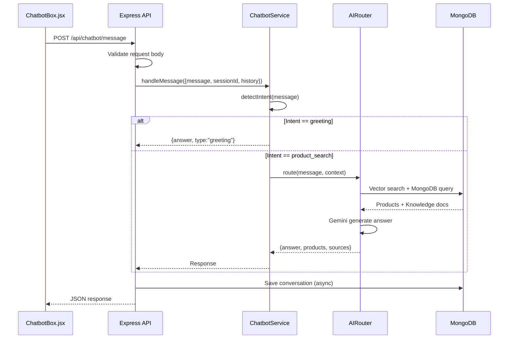

# THIẾT KẾ API — TECHSTORE AI CHATBOT

> **Đồ án tốt nghiệp — Ngành Công nghệ Thông tin**  
> Base URL: `http://localhost:5000/api`  
> Format: REST / JSON  
> Authentication: JWT Bearer Token (tuỳ endpoint)

---

## 1. Tổng quan API

### 1.1 Quy ước chung

```
Base URL:        http://localhost:5000/api
Content-Type:    application/json
Authorization:   Bearer <JWT_TOKEN>  (các endpoint cần auth)
```

### 1.2 Response format chuẩn

**Thành công:**
```json
{
  "success": true,
  "data": { ... },
  "message": "Mô tả kết quả"
}
```

**Lỗi:**
```json
{
  "success": false,
  "message": "Mô tả lỗi thân thiện",
  "error": "Chi tiết lỗi kỹ thuật (dev only)"
}
```

### 1.3 HTTP Status Codes

| Code | Ý nghĩa |
|---|---|
| 200 | Thành công |
| 201 | Tạo mới thành công |
| 400 | Request không hợp lệ |
| 401 | Chưa đăng nhập |
| 403 | Không có quyền |
| 404 | Không tìm thấy |
| 429 | Rate limit exceeded |
| 500 | Lỗi server |

---

## 2. Chatbot API (Core)

### 2.1 Gửi tin nhắn chatbot

**`POST /api/chatbot/message`**

Endpoint chính để giao tiếp với AI chatbot.

**Request Body:**
```json
{
  "sessionId": "guest_abc123def456...",
  "message": "Laptop gaming dưới 25 triệu thương hiệu Asus",
  "history": [
    { "role": "user", "content": "Xin chào" },
    { "role": "assistant", "content": "Chào bạn! Mình có thể giúp gì?" }
  ],
  "context": {
    "url": "http://localhost:3000/products",
    "currentProductId": "507f1f77bcf86cd799439011"
  }
}
```

**Tham số:**
| Field | Type | Bắt buộc | Mô tả |
|---|---|---|---|
| `sessionId` | string | ✅ | ID phiên (unique per browser) |
| `message` | string | ✅ | Câu hỏi/tin nhắn của người dùng |
| `history` | array | ❌ | Lịch sử hội thoại (tối đa 10 turns) |
| `context.url` | string | ❌ | URL trang đang xem |
| `context.currentProductId` | string | ❌ | ID sản phẩm đang xem |

**Response (thành công):**
```json
{
  "success": true,
  "answer": "Dưới đây là top laptop gaming Asus dưới 25 triệu mình tìm được:\n\n**1. ASUS ROG Strix G16**...",
  "products": [
    {
      "id": "507f1f77bcf86cd799439011",
      "name": "ASUS ROG Strix G16 2024",
      "brand": "ASUS",
      "category": "laptop",
      "price": 23990000,
      "stock": 5,
      "imageUrl": "https://...",
      "productUrl": "/product/507f1f77bcf86cd799439011"
    }
  ],
  "sources": [
    {
      "type": "product",
      "title": "ASUS ROG Strix G16",
      "score": 0.92
    }
  ],
  "type": "product_search",
  "quickReplies": [
    { "title": "Xem thêm Asus gaming khác", "payload": "Laptop gaming Asus khác" },
    { "title": "So sánh 2 laptop này", "payload": "So sánh ROG Strix G16 vs TUF Gaming A15" }
  ],
  "flow": "retrieval_first_rag",
  "executionTime": 1842
}
```

**Response (lỗi):**
```json
{
  "success": false,
  "message": "Không thể kết nối AI lúc này, vui lòng thử lại sau.",
  "type": "error"
}
```

---

### 2.2 Gửi tin nhắn kèm ảnh (Multimodal)

**`POST /api/v3/chat`**

Hỗ trợ nhận diện sản phẩm từ ảnh.

**Request Body:**
```json
{
  "sessionId": "guest_abc123...",
  "message": "Sản phẩm này là gì vậy?",
  "imageBase64": "data:image/jpeg;base64,/9j/4AAQSkZJRg...",
  "history": []
}
```

**Response:**
```json
{
  "success": true,
  "answer": "Đây là Chuột Gaming Logitech G502 X Plus...",
  "products": [...],
  "type": "product_search",
  "flow": "gemini_native_multimodal_tool_calling"
}
```

---

### 2.3 Lấy lịch sử hội thoại

**`GET /api/chatbot/history/:sessionId`**

**Query params:**
| Param | Type | Default | Mô tả |
|---|---|---|---|
| `limit` | number | 20 | Số message trả về |
| `skip` | number | 0 | Pagination offset |

**Response:**
```json
{
  "success": true,
  "sessionId": "guest_abc123...",
  "messages": [
    {
      "role": "user",
      "content": "Laptop gaming dưới 25 triệu?",
      "timestamp": "2026-06-15T05:30:00.000Z"
    },
    {
      "role": "assistant",
      "content": "Dưới đây là các laptop gaming...",
      "timestamp": "2026-06-15T05:30:02.143Z",
      "responseMetadata": {
        "generationTime": 2143,
        "model": "gemini-2.5-flash"
      }
    }
  ],
  "total": 24
}
```

---

### 2.4 Health check AI system

**`GET /api/ai-assistant/health`**

**Response:**
```json
{
  "success": true,
  "health": {
    "initialized": true,
    "router": {
      "status": "healthy",
      "agents": {
        "count": 5,
        "registered": [
          "ProductSearchAgent",
          "RecommendationAgent",
          "ComparisonAgent",
          "PCBuilderAgent",
          "KnowledgeAgent"
        ]
      }
    },
    "rag": {
      "available": true,
      "embeddingModel": "Xenova/all-MiniLM-L6-v2",
      "dimension": 384
    },
    "gemini": {
      "ready": true,
      "model": "gemini-2.5-flash"
    }
  }
}
```

---

## 3. Products API

### 3.1 Lấy danh sách sản phẩm

**`GET /api/products`**

**Query params:**
| Param | Type | Default | Mô tả |
|---|---|---|---|
| `page` | number | 1 | Trang |
| `limit` | number | 20 | Số sản phẩm/trang |
| `category` | string | - | Lọc theo danh mục |
| `brand` | string | - | Lọc theo thương hiệu |
| `minPrice` | number | - | Giá tối thiểu (VND) |
| `maxPrice` | number | - | Giá tối đa (VND) |
| `sort` | string | `newest` | `newest` \| `price_asc` \| `price_desc` \| `rating` |
| `search` | string | - | Full-text search |

**Response:**
```json
{
  "success": true,
  "products": [
    {
      "_id": "507f1f77bcf86cd799439011",
      "name": "ASUS ROG Strix G16 2024",
      "category": "laptop",
      "brand": "ASUS",
      "price": 25990000,
      "salePrice": 23990000,
      "stock": 5,
      "rating": 4.8,
      "image": "https://...",
      "specifications": {
        "CPU": "Intel Core i9-14900HX",
        "RAM": "32GB DDR5",
        "GPU": "RTX 4090 16GB"
      }
    }
  ],
  "pagination": {
    "total": 245,
    "page": 1,
    "limit": 20,
    "totalPages": 13
  }
}
```

---

### 3.2 Chi tiết sản phẩm

**`GET /api/products/:id`**

**Response:**
```json
{
  "success": true,
  "product": {
    "_id": "507f1f77bcf86cd799439011",
    "name": "ASUS ROG Strix G16 2024",
    "description": "Laptop gaming cao cấp với...",
    "category": "laptop",
    "brand": "ASUS",
    "price": 25990000,
    "salePrice": 23990000,
    "stock": 5,
    "rating": 4.8,
    "reviewCount": 127,
    "images": ["https://...", "https://..."],
    "specifications": {
      "CPU": "Intel Core i9-14900HX",
      "RAM": "32GB DDR5 5600MHz",
      "GPU": "NVIDIA RTX 4090 16GB GDDR6X",
      "Storage": "2TB PCIe 4.0 NVMe SSD",
      "Display": "16\" QHD+ 240Hz IPS",
      "Battery": "90Wh",
      "Weight": "2.6 kg"
    }
  }
}
```

---

### 3.3 Thêm sản phẩm (Admin)

**`POST /api/products`** — Requires: `Authorization: Bearer <admin_token>`

**Request Body:**
```json
{
  "name": "ASUS TUF Gaming A15 2024",
  "description": "Laptop gaming bền bỉ...",
  "category": "laptop",
  "brand": "ASUS",
  "price": 18990000,
  "costPrice": 15000000,
  "stock": 20,
  "specifications": {
    "CPU": "AMD Ryzen 7 7745HX",
    "RAM": "16GB DDR5",
    "GPU": "RTX 4060 8GB",
    "Storage": "512GB NVMe SSD",
    "Display": "15.6\" FHD 144Hz"
  },
  "images": ["https://..."]
}
```

---

### 3.4 Cập nhật sản phẩm (Admin)

**`PUT /api/products/:id`** — Requires admin JWT

---

### 3.5 Semantic Search (AI-powered)

**`GET /api/products/search/semantic`**

**Query params:**
| Param | Type | Mô tả |
|---|---|---|
| `q` | string | Câu truy vấn tự nhiên |
| `limit` | number | Số kết quả (default: 8) |

**Example:** `GET /api/products/search/semantic?q=laptop%20mỏng%20nhẹ%20pin%20trâu%20cho%20văn%20phòng`

**Response:**
```json
{
  "success": true,
  "query": "laptop mỏng nhẹ pin trâu cho văn phòng",
  "results": [
    {
      "product": { "_id": "...", "name": "Dell XPS 13 Plus", ... },
      "score": 0.8942,
      "matchReason": "semantic similarity"
    }
  ],
  "embeddingTime": 45,
  "searchTime": 123
}
```

---

## 4. Knowledge Base API

### 4.1 Thêm tài liệu kiến thức

**`POST /api/knowledge`** — Requires admin JWT

**Request Body:**
```json
{
  "title": "Hướng dẫn chọn RAM cho laptop",
  "content": "RAM (Random Access Memory) là bộ nhớ tạm thời...",
  "category": "hardware",
  "source": "tech_guide_ram.md"
}
```

**Response:**
```json
{
  "success": true,
  "message": "Đã thêm 3 chunks kiến thức",
  "chunks": 3,
  "embeddingTime": 234
}
```

---

### 4.2 Truy vấn kiến thức (RAG query)

**`POST /api/knowledge/query`**

**Request Body:**
```json
{
  "query": "DDR5 khác DDR4 như thế nào?",
  "limit": 5,
  "category": "hardware"
}
```

**Response:**
```json
{
  "success": true,
  "results": [
    {
      "text": "DDR5 có băng thông gấp đôi DDR4...",
      "source": "ram_guide.md",
      "similarity": 0.8731,
      "category": "hardware"
    }
  ],
  "answer": "DDR5 khác DDR4 ở các điểm chính sau:\n- Băng thông tăng gấp đôi (4800-6400 MT/s vs 2133-3200 MT/s)..."
}
```

---

## 5. Authentication API

### 5.1 Đăng ký

**`POST /api/auth/register`**

```json
// Request
{
  "name": "Nguyễn Văn A",
  "email": "nguyenvana@gmail.com",
  "password": "password123"
}

// Response
{
  "success": true,
  "token": "eyJhbGciOiJIUzI1NiIs...",
  "user": { "id": "...", "name": "Nguyễn Văn A", "email": "...", "role": "user" }
}
```

### 5.2 Đăng nhập

**`POST /api/auth/login`**

```json
// Request
{ "email": "nguyenvana@gmail.com", "password": "password123" }

// Response
{
  "success": true,
  "token": "eyJhbGciOiJIUzI1NiIs...",
  "user": { "id": "...", "name": "Nguyễn Văn A", "role": "user" }
}
```

---

## 6. Cart API

### 6.1 Lấy giỏ hàng

**`GET /api/cart`** — Header: `Authorization: Bearer <token>` hoặc `x-session-id: <sessionId>`

### 6.2 Thêm vào giỏ

**`POST /api/cart/add`**

```json
{
  "productId": "507f1f77bcf86cd799439011",
  "quantity": 1
}
```

---

## 7. Evaluation API (Internal)

### 7.1 Chạy đánh giá batch

**`POST /api/ai-assistant/evaluate`** — Admin only

```json
// Request
{
  "questions": [
    { "id": "Q001", "question": "Laptop gaming dưới 20 triệu?" }
  ],
  "expectedCategories": ["laptop"]
}

// Response
{
  "success": true,
  "results": [{
    "id": "Q001",
    "answer": "...",
    "products": [...],
    "latencyMs": 1842,
    "metrics": {
      "retrievalAccuracy": 0.87,
      "faithfulness": 0.91
    }
  }]
}
```

---

## 8. Sơ đồ luồng API



---

## 9. Rate Limiting

| Endpoint | Limit | Window |
|---|---|---|
| `POST /api/chatbot/message` | 30 req | 1 phút |
| `GET /api/products` | 100 req | 1 phút |
| `POST /api/auth/login` | 10 req | 15 phút |
| `POST /api/knowledge` | 20 req | 1 phút |

---

## 10. Ví dụ CURL Test

```bash
# Test chatbot
curl -X POST http://localhost:5000/api/chatbot/message \
  -H "Content-Type: application/json" \
  -d '{
    "sessionId": "test-session-001",
    "message": "Laptop gaming dưới 30 triệu",
    "history": []
  }'

# Health check
curl http://localhost:5000/api/ai-assistant/health

# Semantic search
curl "http://localhost:5000/api/products/search/semantic?q=laptop%20pin%20trau%20cho%20sinh%20vien&limit=5"
```

---

*Phiên bản: 1.0 — Ngày: 15/06/2026*
