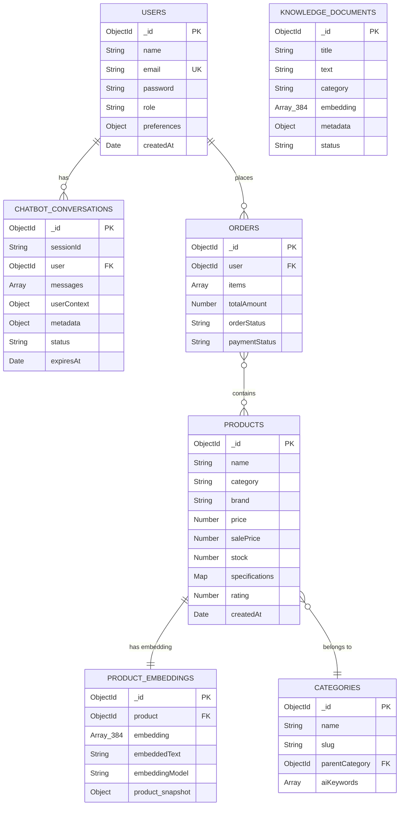

# THIẾT KẾ CƠ SỞ DỮ LIỆU — TECHSTORE AI CHATBOT

> **Đồ án tốt nghiệp — Ngành Công nghệ Thông tin**  
> Hệ quản trị CSDL: MongoDB 6.0 (NoSQL Document Database)

---

## 1. Tổng quan thiết kế

Hệ thống TechStore sử dụng **MongoDB** làm CSDL chính vì:
- Dữ liệu sản phẩm có thông số kỹ thuật đa dạng (schema-less phù hợp)
- Tích hợp native với **MongoDB Atlas Vector Search** cho RAG pipeline
- Khả năng scale horizontal tốt cho e-commerce

---

## 2. Collections chính

### 2.1 Collection `products` — Sản phẩm

```javascript
{
  _id: ObjectId,
  
  // === THÔNG TIN CƠ BẢN ===
  name: String,            // "Laptop ASUS ROG Strix G16 2024"
  description: String,     // Mô tả đầy đủ HTML/text
  category: String,        // "laptop" | "cpu" | "gpu" | "ram" | ...
  subcategory: [String],   // ["gaming", "high-performance"]
  brand: String,           // "ASUS", "MSI", "Intel", ...
  
  // === GIÁ ===
  price: Number,           // Giá gốc (VND)
  salePrice: Number,       // Giá khuyến mãi
  costPrice: Number,       // Giá vốn (internal)
  originalPrice: Number,   // Giá niêm yết gốc
  
  // === TỒN KHO ===
  stock: Number,           // Số lượng tồn
  
  // === HÌNH ẢNH ===
  image: String,           // URL ảnh chính
  images: [String],        // Danh sách URL ảnh
  
  // === THÔNG SỐ KỸ THUẬT ===
  // Map<String, String> — flexible key-value
  specifications: {
    // Laptop example:
    "CPU": "Intel Core i9-14900HX",
    "RAM": "32GB DDR5 5600MHz",
    "Storage": "2TB PCIe 4.0 NVMe SSD",
    "GPU": "NVIDIA RTX 4090 16GB",
    "Display": "16\" QHD+ 240Hz IPS",
    "Battery": "90Wh",
    "OS": "Windows 11 Home",
    "Weight": "2.6 kg"
  },
  
  // === ĐÁNH GIÁ ===
  rating: Number,          // 0-5 sao
  reviewCount: Number,
  reviews: [{
    user: String,
    comment: String,
    rating: Number,
    date: Date
  }],
  
  // === METADATA ===
  createdAt: Date,
  updatedAt: Date
}
```

**Indexes:**
```javascript
// Full-text search
{ name: "text", description: "text", brand: "text" }

// Category + brand filtering
{ category: 1, brand: 1 }
{ price: 1 }
{ rating: -1 }
{ stock: 1 }
{ createdAt: -1 }
```

---

### 2.2 Collection `productembeddings` — Vector Embeddings

```javascript
{
  _id: ObjectId,
  
  product: ObjectId,       // Ref → products._id
  
  // === EMBEDDING VECTOR ===
  // all-MiniLM-L6-v2: 384 chiều float32
  embedding: [Number],     // Array[384] — cosine normalized
  
  // === TEXT ĐÃ ĐƯỢC EMBED ===
  embeddedText: String,    // Chuỗi gốc dùng để tạo embedding
  // VD: "ASUS ROG Strix G16 laptop gaming intel i9 rtx4090 32gb ram 2tb ssd"
  
  // === METADATA ===
  embeddingModel: String,  // "Xenova/all-MiniLM-L6-v2"
  dimension: Number,       // 384
  createdAt: Date,
  updatedAt: Date,
  
  // === PRODUCT SNAPSHOT (denormalized for fast retrieval) ===
  product_snapshot: {
    name: String,
    brand: String,
    category: String,
    price: Number,
    salePrice: Number,
    stock: Number,
    rating: Number,
    image: String,
    specifications: Object
  }
}
```

**Atlas Vector Search Index:**
```json
{
  "name": "product_embedding_index",
  "definition": {
    "fields": [{
      "type": "vector",
      "path": "embedding",
      "numDimensions": 384,
      "similarity": "cosine"
    }, {
      "type": "filter",
      "path": "product_snapshot.category"
    }, {
      "type": "filter", 
      "path": "product_snapshot.brand"
    }]
  }
}
```

---

### 2.3 Collection `knowledgedocuments` — Knowledge Base RAG

```javascript
{
  _id: ObjectId,
  
  // === NỘI DUNG ===
  title: String,           // "Hướng dẫn chọn RAM cho laptop"
  text: String,            // Chunk nội dung (tối đa 800 ký tự/chunk)
  source: String,          // "tech_guide_ram.md", "product_faq.md"
  
  // === PHÂN LOẠI ===
  category: {
    type: String,
    enum: [
      "hardware",           // CPU, RAM, SSD, GPU, Mainboard
      "technology",         // Công nghệ, chuẩn giao tiếp
      "product_spec",       // Thông số sản phẩm cụ thể
      "networking",         // Router, WiFi
      "programming",        // Lập trình, IDE
      "ai_ml",             // AI, Machine Learning
      "security",          // Bảo mật
      "cloud",             // Cloud computing
      "general"            // Kiến thức chung
    ]
  },
  
  // === EMBEDDING ===
  embedding: [Number],     // Array[384]
  status: String,          // "pending" | "completed" | "failed"
  
  // === CHUNKING METADATA ===
  metadata: {
    chunkIndex: Number,    // Thứ tự chunk trong document gốc
    totalChunks: Number,   // Tổng số chunks
    wordCount: Number,
    language: String       // "vi" | "en"
  },
  
  createdAt: Date,
  updatedAt: Date
}
```

**Atlas Vector Search Index:**
```json
{
  "name": "knowledge_embedding_index",
  "definition": {
    "fields": [{
      "type": "vector",
      "path": "embedding",
      "numDimensions": 384,
      "similarity": "cosine"
    }, {
      "type": "filter",
      "path": "category"
    }, {
      "type": "filter",
      "path": "status"
    }]
  }
}
```

---

### 2.4 Collection `chatbotconversations` — Lịch sử hội thoại

```javascript
{
  _id: ObjectId,
  
  // === ĐỊNH DANH SESSION ===
  sessionId: String,       // "guest_abc123..." (unique per browser session)
  user: ObjectId,          // Ref → users._id (null nếu anonymous)
  
  // === NGỮ CẢNH NGƯỜI DÙNG ===
  userContext: {
    isAuthenticated: Boolean,
    userName: String,
    deviceType: String,    // "desktop" | "mobile" | "tablet"
    currentPage: String,
    currentProduct: ObjectId,
    purchaseHistory: {
      totalOrders: Number,
      totalSpent: Number,
      favoriteCategories: [String]
    }
  },
  
  // === MESSAGES ===
  messages: [{
    _id: ObjectId,
    role: String,          // "user" | "assistant" | "system"
    content: String,       // Nội dung message
    
    // AI metadata
    intent: String,        // Intent được phát hiện
    intentConfidence: Number,
    
    // Entities trích xuất
    entities: [{
      type: String,        // "product" | "brand" | "price" | "category"
      value: String,
      confidence: Number
    }],
    
    // Sản phẩm được đề cập
    referencedItems: {
      products: [ObjectId],
      categories: [ObjectId]
    },
    
    // Metadata phản hồi
    responseMetadata: {
      generationTime: Number,   // ms
      tokensUsed: Number,
      model: String,            // "gemini-2.5-flash"
      ragFlow: String,          // "retrieval_first_rag" | "gemini_native"
      fallbackUsed: Boolean
    },
    
    // Feedback người dùng
    feedback: {
      helpful: Boolean,
      rating: Number,           // 1-5
      comment: String
    },
    
    timestamp: Date
  }],
  
  // === TÓM TẮT CUỘC HỘI THOẠI ===
  conversationSummary: {
    mainTopics: [String],        // Chủ đề chính
    productsMentioned: [ObjectId],
    userNeeds: [String],
    unresolvedQuestions: [String]
  },
  
  // === METADATA ===
  metadata: {
    startedAt: Date,
    lastMessageAt: Date,
    messageCount: Number,
    avgResponseTime: Number,    // ms
    primaryIntent: String,
    resolved: Boolean
  },
  
  // === TRẠNG THÁI ===
  status: String,              // "active" | "completed" | "abandoned"
  
  // TTL — Tự xóa sau 30 ngày
  expiresAt: Date,
  
  createdAt: Date,
  updatedAt: Date
}
```

**Indexes:**
```javascript
{ sessionId: 1 }
{ user: 1 }
{ status: 1 }
{ createdAt: -1 }
{ expiresAt: 1 }  // TTL index (expireAfterSeconds: 0)
```

---

### 2.5 Collection `users` — Người dùng

```javascript
{
  _id: ObjectId,
  name: String,
  email: String,           // Unique
  password: String,        // bcrypt hash
  role: String,            // "user" | "admin"
  
  // OAuth
  googleId: String,
  facebookId: String,
  
  // Profile
  phone: String,
  address: {
    street: String,
    ward: String,
    district: String,
    city: String
  },
  
  // Preferences cho AI recommendation
  preferences: {
    favoriteCategories: [String],
    priceRange: { min: Number, max: Number },
    brands: [String]
  },
  
  createdAt: Date,
  updatedAt: Date
}
```

---

### 2.6 Collection `categories` — Danh mục

```javascript
{
  _id: ObjectId,
  name: String,            // "Laptop"
  slug: String,            // "laptop" (URL-friendly)
  description: String,
  image: String,
  parentCategory: ObjectId, // null nếu là danh mục gốc
  
  // AI metadata
  aiKeywords: [String],    // Từ khóa để AI nhận dạng
  productCount: Number,
  
  createdAt: Date
}
```

---

### 2.7 Collection `orders` — Đơn hàng

```javascript
{
  _id: ObjectId,
  user: ObjectId,
  sessionId: String,
  
  items: [{
    product: ObjectId,
    name: String,          // Snapshot tại thời điểm mua
    price: Number,
    quantity: Number,
    image: String
  }],
  
  totalAmount: Number,
  
  shippingAddress: {
    name: String,
    phone: String,
    address: String,
    city: String
  },
  
  paymentMethod: String,   // "cod" | "zalopay" | "bank_transfer"
  paymentStatus: String,   // "pending" | "paid" | "failed"
  orderStatus: String,     // "pending" | "confirmed" | "shipping" | "delivered" | "cancelled"
  
  // ZaloPay
  zpTransId: String,
  
  createdAt: Date,
  updatedAt: Date
}
```

---

## 3. Entity Relationship Diagram



---

## 4. Data Flow — Embedding Pipeline

```
Sản phẩm mới được thêm vào MongoDB
       ↓
[Script: sync-products]
       ↓
Lấy text: name + brand + category + specs + description
       ↓
[EmbeddingService] → all-MiniLM-L6-v2 (CPU inference)
       ↓
vector [384 float32] normalized
       ↓
Lưu vào productEmbeddings collection
       ↓
Đồng bộ sang ChromaDB (nếu CHROMA_URL configured)
       ↓
Atlas Vector Search Index được cập nhật tự động
```

---

## 5. Knowledge Base Structure (ChromaDB)

```
ChromaDB Collections:
├── techstore_knowledge      ← Kiến thức công nghệ chung
│   ├── hardware/            ← CPU, RAM, SSD, GPU guides
│   ├── technology/          ← PCIe, DDR5, HDMI standards
│   ├── product_spec/        ← Thông số sản phẩm cụ thể
│   └── general/             ← FAQ, chính sách, hướng dẫn
│
└── techstore_products       ← Product embeddings (mirror)
    └── [product vectors]
```

---

## 6. Tối ưu hóa truy vấn

### 6.1 Truy vấn sản phẩm theo ngân sách + brand
```javascript
// Optimized with compound index
db.products.find({
  category: { $regex: /laptop/i },
  brand: { $regex: /asus/i },
  price: { $lte: 25000000 },
  stock: { $gt: 0 }
}).sort({ rating: -1, sold: -1 }).limit(8)
// → Uses index: { category: 1, brand: 1 }
```

### 6.2 Vector Search (Atlas)
```javascript
db.productEmbeddings.aggregate([
  {
    $vectorSearch: {
      index: "product_embedding_index",
      path: "embedding",
      queryVector: [0.12, -0.34, ...],  // 384 dims
      numCandidates: 40,
      limit: 5,
      filter: { "product_snapshot.category": "laptop" }
    }
  },
  {
    $project: {
      product_snapshot: 1,
      score: { $meta: "vectorSearchScore" }
    }
  }
])
// → Returns top-5 semantically similar products
```

---

*Phiên bản: 1.0 — Ngày: 15/06/2026*
