# KIẾN TRÚC HỆ THỐNG CHATBOT AI TECHSTORE

> **Đồ án tốt nghiệp — Ngành Công nghệ Thông tin**  
> Đề tài: Xây dựng hệ thống Chatbot AI tư vấn sản phẩm và hỗ trợ kiến thức công nghệ  
> Ứng dụng mô hình Retrieval-Augmented Generation (RAG)

---

## 1. Tổng quan hệ thống

### 1.1 Mục tiêu

Hệ thống Chatbot AI TechStore được xây dựng nhằm:

- Hỗ trợ người dùng tìm kiếm, tư vấn, so sánh sản phẩm công nghệ một cách tự nhiên
- Ứng dụng mô hình **Retrieval-Augmented Generation (RAG)** để trả lời chính xác từ dữ liệu thực
- Tích hợp liền mạch vào giao diện website thương mại điện tử TechStore
- Không tự bịa đặt thông tin sản phẩm — ưu tiên dữ liệu từ CSDL

### 1.2 Các thành phần chính

| Thành phần | Công nghệ | Vai trò |
|---|---|---|
| **Frontend** | React.js | Giao diện chat tích hợp vào website |
| **Backend API** | Node.js + Express | Xử lý request, điều phối AI |
| **AI Orchestrator** | AIRouter.js | Định tuyến flow xử lý |
| **LLM** | Google Gemini 2.5 Flash | Sinh câu trả lời ngôn ngữ tự nhiên |
| **Embedding Model** | all-MiniLM-L6-v2 | Tạo vector embedding (384 chiều) |
| **Vector Search** | MongoDB Atlas Vector Search | Tìm kiếm ngữ nghĩa |
| **Vector DB** | ChromaDB (local) | LÆ°u knowledge base |
| **Database** | MongoDB | Lưu sản phẩm, đơn hàng, hội thoại |

---

## 2. Kiến trúc tổng thể

### 2.1 Sơ đồ kiến trúc hệ thống

```mermaid
graph TB
    subgraph CLIENT["🌐 Client Layer (Frontend)"]
        UI[Website TechStore]
        CHAT[ChatbotBox Component]
        UI --> CHAT
    end

    subgraph GATEWAY["🔀 API Gateway (Express.js - Port 5000)"]
        ROUTE["/api/chatbot/message"]
        AUTH[JWT Middleware]
        RATE[Rate Limiter]
        ROUTE --> AUTH --> RATE
    end

    subgraph ORCHESTRATOR["🧠 AI Orchestrator Layer"]
        INTENT[Intent Detector]
        ROUTER[AIRouter - Unified Flow]
        INTENT --> ROUTER
    end

    subgraph RAG["📚 RAG Pipeline"]
        EMBED[EmbeddingService\nall-MiniLM-L6-v2 384d]
        VSEARCH[VectorSearchService\nAtlas Vector Search]
        RAGP[RAGPipeline\nContext Assembly]
        EMBED --> VSEARCH --> RAGP
    end

    subgraph AGENTS["🤖 Specialized Agents"]
        PSA[ProductSearchAgent]
        RCA[RecommendationAgent]
        CPA[ComparisonAgent]
        PCBA[PCBuilderAgent]
        KNA[KnowledgeAgent]
    end

    subgraph LLM["âš¡ LLM Layer"]
        GEMINI[Google Gemini 2.5 Flash\nTool Calling + Multimodal]
    end

    subgraph DATA["💾 Data Layer"]
        MONGO[(MongoDB\nProducts, Orders\nConversations)]
        CHROMA[(ChromaDB\nKnowledge Base)]
        MEMCACHE[In-memory Cache\nResponse Cache 30s]
    end

    CHAT -->|POST| ROUTE
    RATE --> INTENT
    ROUTER -->|RAG-first| EMBED
    ROUTER -->|Tool-calling| GEMINI
    ROUTER --> AGENTS
    RAGP --> GEMINI
    AGENTS --> MONGO
    AGENTS --> CHROMA
    AGENTS --> GEMINI
    VSEARCH --> MONGO
    VSEARCH --> CHROMA
    GEMINI -->|Tool call| MONGO
    ROUTER --> MEMCACHE
    GEMINI -->|Response| ROUTE
    ROUTE -->|JSON| CHAT
```



### 2.2 Sơ đồ luồng xử lý RAG Pipeline

```mermaid
sequenceDiagram
    participant U as 👤 User
    participant F as 💻 Frontend
    participant API as 🔀 API Server
    participant ID as 🎯 IntentDetector
    participant AR as 🧠 AIRouter
    participant ES as 📐 EmbeddingService
    participant VS as 🔍 VectorSearch
    participant RP as 📚 RAGPipeline
    participant G as âš¡ Gemini 2.5 Flash
    participant DB as 💾 MongoDB

    U->>F: Nhập câu hỏi
    F->>API: POST /api/chatbot/message\n{sessionId, message, history}
    
    API->>ID: detectIntent(message)
    
    alt Intent: greeting/thanks/goodbye
        ID-->>API: Short-circuit response
        API-->>F: Trả lời tức thì (0ms DB call)
    else Intent: product/compare/knowledge
        ID-->>AR: intent detected
        
        AR->>AR: shouldUseToolFlow?
        
        alt RAG-first flow (EmbeddingService available)
            AR->>ES: embedText(query)
            ES-->>AR: queryVector[384]
            
            par Parallel retrieval
                AR->>VS: searchSimilarProducts(vector, k=5)
                VS->>DB: Atlas $vectorSearch\n(product_embedding_index)
                DB-->>VS: Top-K products
                VS-->>AR: productContext[]
            and
                AR->>VS: searchKnowledgeDocs(vector, k=5)
                VS->>DB: Atlas $vectorSearch\n(knowledge_embedding_index)
                DB-->>VS: Top-K knowledge chunks
                VS-->>AR: knowledgeContext[]
            end
            
            AR->>RP: buildContextBlocks(products, knowledge)
            RP->>G: generateRagAnswer(systemPrompt, context, question)
            G-->>RP: Generated answer
            RP-->>AR: {answer, sources, products}
            
        else Tool-calling flow (Gemini native)
            AR->>G: chatWithTools(message, history, tools)
            G->>G: Analyze intent + plan tools
            G->>DB: search_products(keyword)
            DB-->>G: Product results
            G-->>AR: {answer, products, toolTrace}
        end
        
        AR->>AR: evaluateRagConfidence()
        AR-->>API: {answer, products, sources, flow}
        API-->>F: Response JSON
        F-->>U: Render message + product cards
    end
```



---

## 3. Kiến trúc 5 Specialized Agents

### 3.1 Sơ đồ agents

```mermaid
graph LR
    subgraph ROUTER["AIRouter (Orchestrator)"]
        IR[Intent Router]
    end

    subgraph AGENTS["5 Specialized Agents"]
        PSA["🔍 ProductSearchAgent\n- Tìm kiếm sản phẩm\n- Lọc theo giá, brand\n- Hybrid search"]
        RCA["💡 RecommendationAgent\n- Gợi ý theo nhu cầu\n- Gaming/Office/Student\n- Budget-aware"]
        CPA["⚖️ ComparisonAgent\n- So sánh 2-4 sản phẩm\n- Bảng markdown\n- Phân tích ưu/nhược"]
        PCBA["🖥️ PCBuilderAgent\n- Build PC theo ngân sách\n- Kiểm tra tương thích\n- Tối ưu hiệu năng"]
        KNA["📖 KnowledgeAgent\n- CPU/RAM/SSD/GPU\n- Giải thích công nghệ\n- Tư vấn kỹ thuật"]
    end

    subgraph ENGINES["Shared Engines"]
        HSE["🔄 HybridSearchEngine\n40% Keyword + 60% Semantic"]
        VRE["🧮 VectorRAGEngine\nContext-aware RAG"]
    end

    IR -->|product_search| PSA
    IR -->|recommendation| RCA
    IR -->|compare| CPA
    IR -->|pc_build| PCBA
    IR -->|knowledge| KNA

    PSA --> HSE
    RCA --> HSE
    CPA --> HSE
    PCBA --> HSE
    KNA --> VRE

    HSE --> MongoDB[(MongoDB)]
    VRE --> ChromaDB[(ChromaDB)]
```



### 3.2 Bảng năng lực agent

| Agent | Intent triggers | Nguồn dữ liệu | Ví dụ |
|---|---|---|---|
| ProductSearchAgent | product_search, price_query | MongoDB, Vector Search | "Laptop gaming dưới 30 triệu" |
| RecommendationAgent | recommendation, advice | MongoDB, ChromaDB | "Gợi ý laptop cho sinh viên lập trình" |
| ComparisonAgent | compare, vs, so sánh | MongoDB | "So sánh RTX 4060 vs RTX 4070" |
| PCBuilderAgent | pc_build, build_pc | MongoDB | "Build PC gaming 40 triệu" |
| KnowledgeAgent | knowledge, greeting, help | ChromaDB, Gemini | "SSD NVMe là gì?" |

---

## 4. Kiến trúc dữ liệu

### 4.1 Embedding & Vector Search

```mermaid
graph TB
    subgraph EMBED_PIPELINE["Embedding Pipeline"]
        TEXT[Product text\nname + brand + category\n+ specs + description]
        MODEL[all-MiniLM-L6-v2\nCPU inference\nXenova/transformers.js]
        VECTOR[Vector [384 float32]\nCosine similarity]
        TEXT --> MODEL --> VECTOR
    end

    subgraph STORAGE["Vector Storage"]
        MONGO_VEC[(MongoDB Atlas\nproductEmbeddings collection\n+ knowledge_embedding_index)]
        CHROMA_VEC[(ChromaDB Local\ntechstore_knowledge\ntechstore_products)]
        VECTOR --> MONGO_VEC
        VECTOR --> CHROMA_VEC
    end

    subgraph SEARCH["Search at Query Time"]
        QUERY[User query]
        Q_EMBED[Query embedding\n384-dim]
        KNNV[kNN Vector Search\nnumCandidates=40\ntop-K=5-8]
        QUERY --> Q_EMBED --> KNNV
        KNNV --> MONGO_VEC
        KNNV --> CHROMA_VEC
    end
```

### 4.2 Hybrid Search Engine

```
Hybrid Score = α × KeywordScore + β × SemanticScore
               α = 0.40 (TF-IDF/BM25)
               β = 0.60 (Cosine similarity)

Multi-factor ranking:
  finalScore = hybridScore × popularityBoost × stockBoost × ratingBoost
```

---

## 5. Luồng xử lý chi tiết từng intent

### 5.1 Product Search Flow

```
User: "Laptop gaming dưới 25 triệu thương hiệu Asus"
  │
  ├─ [IntentDetector] → "product_search" (confidence: 0.92)
  ├─ [BudgetExtractor] → {maxPrice: 25_000_000}
  ├─ [BrandExtractor] → {brand: "Asus"}
  │
  ├─ [HybridSearch] → MongoDB query:
  │    { category: /laptop/i, brand: /asus/i, price: {$lte: 25000000} }
  │    + Vector semantic search
  │
  ├─ [EmbeddingService] → embed("Laptop gaming Asus 25 triệu")
  ├─ [VectorSearch] → Top 5 similar products
  │
  ├─ [RAGPipeline] → Build context + prompt
  ├─ [Gemini 2.5 Flash] → Generate recommendation text
  │
  └─ Response: { answer, products[5], sources, type:"product_search" }
```

### 5.2 Comparison Flow

```
User: "So sánh RTX 4060 với RTX 4070"
  │
  ├─ [IntentDetector] → "compare" (confidence: 0.95)
  ├─ [ComparisonParser] → fragments: ["RTX 4060", "RTX 4070"]
  │
  ├─ [MongoDB] → findOne({ name: /RTX 4060/ }) → product A
  ├─ [MongoDB] → findOne({ name: /RTX 4070/ }) → product B
  │
  ├─ [Gemini 2.5 Flash] → Generate comparison table:
  │    systemPrompt: "Trả lời dạng bảng markdown, không bịa thông số"
  │    context: [productA specs, productB specs]
  │
  └─ Response: { answer (markdown table), products[2], type:"compare" }
```

### 5.3 PC Builder Flow

```
User: "Build PC gaming 40 triệu"
  │
  ├─ [IntentDetector] → "pc_build" (confidence: 0.93)
  ├─ [BudgetParser] → {budget: 40_000_000}
  ├─ [UseCaseParser] → {useCase: "gaming"}
  │
  ├─ [PCBuilderAgent] → Component selection:
  │    CPU: ~25% budget → 10,000,000
  │    GPU: ~35% budget → 14,000,000
  │    RAM: ~8% budget  →  3,200,000
  │    SSD: ~5% budget  →  2,000,000
  │    ...etc
  │
  ├─ [MongoDB] × N → Find best product per component
  ├─ [CompatibilityChecker] → Validate CPU-MB socket, PSU wattage
  │
  ├─ [Gemini 2.5 Flash] → Generate build summary + explanation
  │
  └─ Response: { answer, products[6-8 components], buildConfig, type:"pc_build" }
```

---

## 6. Bảo mật & Xử lý lỗi

### 6.1 Input Safety

```javascript
// Ví dụ: Unsafe content detection
const UNSAFE_PATTERNS = [
  /ma tuy|thuoc no|vu khi|hack|crack|ddos/i,
  /tu tu|tu sat|giet|khung bo/i,
];
// → Return { type: 'out_of_scope', answer: "Từ chối lịch sự" }
```

### 6.2 Hallucination Prevention

- **Không tự bịa thông số**: System prompt bắt buộc dùng dữ liệu context
- **Confidence check**: `evaluateRagConfidence()` kiểm tra độ tin cậy RAG output
- **Fallback chain**: RAG → Tool-calling → Gemini general → Friendly error
- **Safety override**: Nếu answer chứa "vui lòng thử lại" → retry với RAG

### 6.3 Error Handling Flow

```
AI Error → Log error với requestId
         → Return fallback message (không expose internal error)
         → Monitor error rate (nếu > threshold → alert)
```

---

## 7. Performance & Scalability

### 7.1 Caching Strategy

| Layer | Strategy | TTL |
|---|---|---|
| Response Cache | In-memory Map (500 entries) | 30 giây |
| Embedding Cache | File-based (.cache/transformers) | Permanent |
| MongoDB Query | Built-in cursor cache | MongoDB managed |

### 7.2 Timeout & Circuit Breaker

```
RAG timeout: 9,000ms (env: AI_RAG_TIMEOUT_MS)
Gemini timeout: 30,000ms
Circuit breaker: GROQ_CB_FAILURE_THRESHOLD=4, open=45s
```

### 7.3 Performance Targets

| Metric | Target | Current |
|---|---|---|
| Response time | < 3s | ~2.14s avg |
| Intent accuracy | > 90% | ~92% |
| Faithfulness | > 70% | ~91.2% |
| Concurrent users | 100+ | Tested 50 |

---

## 8. Tech Stack chi tiết

### 8.1 Backend Dependencies

```json
{
  "@google/generative-ai": "^0.24.0",
  "@langchain/google-genai": "latest",
  "@xenova/transformers": "^2.17.2",
  "chromadb": "^1.10.7",
  "express": "^4.21.2",
  "mongoose": "^8.13.2",
  "passport": "^0.7.0",
  "jsonwebtoken": "^9.0.2"
}
```

### 8.2 Frontend Dependencies

```json
{
  "react": "^18.3.1",
  "react-router-dom": "^6.29.0",
  "react-markdown": "^9.0.3",
  "lucide-react": "^0.511.0",
  "axios": "^1.9.0"
}
```

---

## 9. Môi trường triển khai

### 9.1 Development

```
Frontend:  http://localhost:3000  (npm start)
Backend:   http://localhost:5000  (npm run dev)
MongoDB:   MongoDB Atlas (cloud) hoặc localhost:27017
ChromaDB:  http://localhost:8000  (python src/scripts/run_chroma_fastapi.py)
```

### 9.2 Production

```text
Backend:  Node.js (PORT=5000)
Frontend: React build served by backend or static hosting
ChromaDB: Python FastAPI server (PORT=8000)
MongoDB:  Atlas (external)
```

### 9.3 Biến môi trường quan trọng

```env
GEMINI_API_KEY=        # Google AI Studio API key
GEMINI_MODEL=gemini-2.5-flash
MONGODB_URI=           # Atlas connection string
CHROMA_URL=http://localhost:8000
EMBEDDING_DIMENSION=384
AI_RESPONSE_CACHE_ENABLED=false
AI_RAG_TIMEOUT_MS=9000
```

---

*Tài liệu này được tạo phục vụ đồ án tốt nghiệp ngành Công nghệ Thông tin.*  
*Phiên bản: 1.0 — Ngày cập nhật: 15/06/2026*
